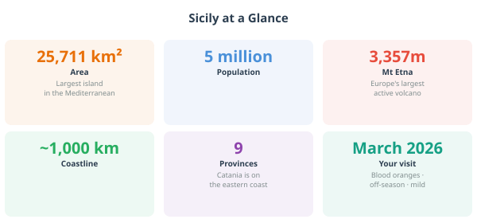
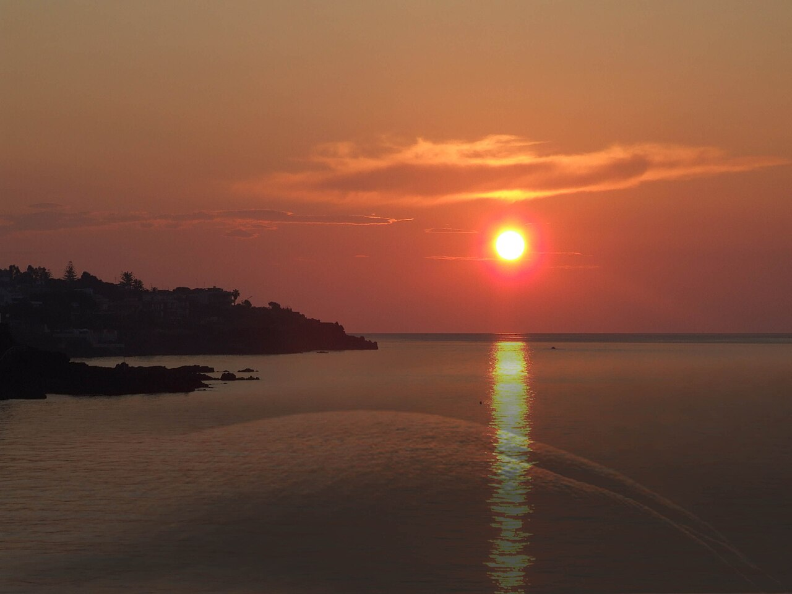

# Chapter 1: Welcome to Sicily

---

> *"Sicily is not Italy. It is something stranger, older, more layered —
> an island that has been conquered by everyone and domesticated by no one."*

---

You are about to land on the largest island in the Mediterranean. As the plane
descends and you get your first glimpse of the coastline — dark volcanic rock,
turquoise water, the white sprawl of a city against a mountain that is quietly,
constantly smoking — it's worth pausing to take it in. Whatever you were
expecting, Sicily will be something slightly different.

That's not a warning. It's the best thing about it.

---

## 1.1 The Island in Numbers

Before the stories, a quick orientation.

Sicily sits at the toe of Italy's boot, separated from the mainland by the
Strait of Messina — a gap of just 3 kilometres at its narrowest. It is the
largest island in the Mediterranean, roughly the size of Switzerland, with a
coastline of nearly 1,500 km. Five million people live here, and they will
tell you, with varying degrees of seriousness, that they are Sicilian first
and Italian second.

The island has five UNESCO World Heritage Sites. It has one active volcano —
Europe's largest, and one of the most active in the world. It has Greek
temples that predate the Parthenon. It has baroque towns rebuilt from scratch
after one of the worst earthquakes in European history. It grows blood oranges,
pistachios, capers, almonds, and some of the most interesting wine grapes on
the continent.

It also has the best street food in Italy, and anyone who disagrees with that
is wrong.

---

*A clean stats panel alongside a silhouette map of Sicily overlaid on a
western European outline for scale. Stats to include: area (25,711 km²),
coastline (1,484 km), population (5 million), highest point (Etna, 3,357 m),
UNESCO sites (5), neighbouring countries visible on a clear day (Tunisia,
Malta, mainland Italy). Style: bold numbers, simple icons, warm colour palette.*

---

## 1.2 Who Made Sicily? The Five-Minute Version

Here is the thing about Sicily: it has been invaded, colonised, conquered, and
ruled by almost every major power in Mediterranean history. The Greeks came.
Then the Romans. Then the Arabs, the Normans, the French, the Spanish. Each
one left something behind — in the food, the architecture, the language, the
face of the person selling you a cannolo.

What makes Sicily extraordinary is not that all these cultures passed through,
but that they *layered*. They didn't replace each other — they accumulated.
You can see it in a single building in Palermo: Arab arches, Byzantine mosaics,
Norman stonework, Spanish baroque facade, all on the same church. You can taste
it in a single dish: aubergine, pine nuts, raisins, tomato, vinegar —
ingredients and flavour combinations that trace a line directly back to the
Arab kitchen of the 10th century.

Eating in Sicily, it turns out, is a form of time travel.

### The cast of characters, in rough order of arrival:

**The Greeks** arrived around 750 BC and set up colonies along the east and
south coasts. They built Syracuse into one of the most powerful cities in the
ancient world — larger than Athens at its peak. They left behind theatres,
temples, and a geometric approach to town planning that you can still read in
the street grids of Catania and Syracuse. When you stand in the Greek theatre
at Taormina and look out at the sea, you are standing where Aeschylus may have
stood. That is not nothing.

**The Romans** arrived in the 3rd century BC, took Sicily after a long and
nasty war with Carthage, and promptly turned the island into their grain
basket. Sicily fed Rome. In exchange, the Romans built roads, cities, and some
extraordinary mosaics — the Villa Romana del Casale near Piazza Armerina has
floor mosaics so well preserved they look freshly laid. The Romans were
efficient. They were not the most interesting rulers Sicily ever had.

**The Arabs** are the surprise. From the 9th to the 11th century, Arab and
Berber forces from North Africa ruled much of Sicily, and what they left behind
was transformative. They brought citrus trees: the orange and lemon groves that
still cover the Conca d'Oro plain near Palermo. They brought sugar cane and the
concept of iced sweets — the ancestor of every granita you will eat on this
trip. They brought rice (arancino), aubergine, and a spice palette — cinnamon,
saffron, cumin — that survives in Sicilian cooking to this day and makes it
unlike any other regional Italian cuisine. They also improved the irrigation
systems, reorganised agricultural production, and by most accounts governed
the island rather well.

**The Normans** are the strangest chapter. Normans — descendants of Vikings
who had settled in northern France, then carved out territories in southern
Italy — conquered Sicily in the 11th century. What they built there is one of
the genuine artistic miracles of the medieval world: churches that combined
Arab geometric decoration, Byzantine gold mosaics, and Norman stone architecture
into something that shouldn't work but absolutely does. The Cappella Palatina
in Palermo is the finest example. It looks like nowhere else on Earth.

**The Spanish** arrived in the 15th century and stayed for two and a half
centuries. Their most visible legacy is the baroque — that theatrical,
extravagant, almost defiantly optimistic architectural style that defines the
towns of eastern Sicily. After the catastrophic earthquake of 1693 levelled
most of the east coast, Spanish-era aristocrats and the Church rebuilt on a
grand scale. The result is the Val di Noto, a collection of baroque towns so
remarkable they are a UNESCO World Heritage Site as a group. Catania is one
of them.

**Modern Italy** arrived in 1861 with unification, which many Sicilians greeted
with ambivalence then and regard with ambivalence now. Sicily remained, and
remains, a place apart. The dialect is so different from standard Italian that
some linguists classify it as a separate language. The culture, the food, the
pace, the priorities — all distinctly Sicilian.

---

> **Fun fact to tell your toddler in about fifteen years:** The word *sugar*
> comes from the Arabic *sukkar*, which comes from the Sanskrit *sharkara*.
> Sicily was one of the main routes by which sugar reached medieval Europe.
> Every time you eat a cannolo, you are at the end of an ingredient's journey
> from ancient India via the Arab world to a pastry counter in Catania. Your
> toddler, currently destroying a granita at high speed, is participating in
> civilisation.

---

## 1.3 The Sicilian Character

Sicilians are not quite like mainland Italians, and they know it. There is a
particular combination of qualities you will encounter: warmth, pride,
pragmatism, a certain philosophical calm in the face of difficulty, and an
extremely well-developed sense of hospitality.

The last one matters most for your trip. You are travelling with a small child.
In Sicily, this is an asset. Children are adored here — openly, effusively,
without the northern European awkwardness about touching strangers' children.
People will stop you in the street to admire your toddler. The waiter will
bring something the child didn't order because he thought they might like it.
The woman at the market will press a piece of fruit into small hands before
you've had a chance to say anything. Accept all of this with grace and a
smile. *Grazie mille.*

There is also the concept of *arrangiarsi* — literally "to arrange oneself,"
but really meaning the art of improvising, of finding a way through. Sicilians
have been making do under difficult circumstances for a very long time. It
produces a culture that is resourceful, flexible, and genuinely good at
figuring things out on the fly. This is useful information if your car breaks
down or you arrive at a restaurant to find it closed for a family celebration
and the owner, instead of sending you away, seats you at the family table.
This has been known to happen.

One practical note: Sicilian is spoken alongside Italian, and in older
generations may be preferred. You will hear it in markets, between friends,
and in animated telephone conversations. Standard Italian is universally
understood and will serve you well. A few words of Sicilian — *beddu/bedda*
(beautiful, said constantly of small children), *manciari* (to eat, something
you will do a lot of) — will be received with delight out of proportion to
the effort involved in learning them.

---

> **A note on the famous Sicilian fatalism:** Living on an island that gets
> regularly shaken by earthquakes and has an active volcano visible from the
> city centre does something to your philosophy of life. Sicilians are not
> pessimistic — they are realistic in a way that has been earned over several
> thousand years of occupation, natural disaster, and the general difficulty
> of being Sicily. When something goes wrong, the response is rarely panic.
> It is usually a shrug, a coffee, and the question: *what do we do now?*
> This is an excellent travel mindset. Adopt it.

---

## 1.4 Why Catania? (And Not Palermo)

Every guide to Sicily eventually has to answer this question, so let's get it
out of the way.

Palermo is Sicily's capital: bigger, grander, more famous, and the obvious
choice if you are ticking boxes. It has extraordinary things — the Norman
palace, the Cappella Palatina, the Ballarò market, the Teatro Massimo. If you
have ten days and two cities, go to both.

But if you have one week and a toddler and a rental car, **Catania is the
better base**. Here's why.

**Position.** Catania sits on the east coast, and from Catania you can reach
Etna, Taormina, Syracuse, and the Cyclops coast all within an hour by car.
The east coast has the best concentration of things to see. Palermo is on the
other side of the island — beautiful things exist there too, but you would be
driving two or three hours each way to reach most of what makes Sicily famous.

**The airport.** Catania Fontanarossa is one of the best-positioned airports
in Italy: 5 km from the city centre, well-connected, easy to exit with a
rental car. You will not waste a day navigating airport chaos.

**The city itself.** Catania is underrated in a way that Palermo no longer is.
It is scrappier, rougher around the edges, less polished for tourists — and
for exactly those reasons, more real. The market is extraordinary. The baroque
is UNESCO-listed and largely free to walk around. The street food is arguably
better. The prices are noticeably lower. And because fewer first-time visitors
put it on their list, you will find yourself in places that feel like they
belong to the Catanesi rather than to you.

**The volcano.** Etna is visible from the city. Not in the vague "you might
see mountains on the horizon" sense — on a clear day, from Via Etnea, you look
north and there it is: a massive, snow-capped, occasionally smoking presence.
The city is built on its lava. The cathedral is black with it. The pavements
are made of it. Catania's entire character is shaped by living in the shadow
of an active volcano, and that is fascinating in a way that no amount of
excellent Norman architecture can replicate.

---

*Should show: Catania's position on the coast with Etna visible behind it,
and annotated distances to the main day trips — Etna (30 km), Taormina (50 km),
Syracuse (60 km), Aci Trezza (15 km). Clean graphic style, could be a
custom illustrated map rather than a satellite image.*

---

> **The lava city, briefly:** Catania has been destroyed by Etna's eruptions
> multiple times. The great lava flow of 1669 reached the sea and added land
> to the coastline — Castello Ursino, which was once a coastal fortress, is
> now 2 km inland because of it. The city was then levelled by the 1693
> earthquake. It was rebuilt, from scratch, in baroque, mostly using the same
> black basalt lava rock. There is something almost defiant about a city that
> uses the material that keeps destroying it to rebuild itself, over and over,
> into something more beautiful each time.

---

*Next: Chapter 2 — Catania: City of Fire & Baroque*

---
