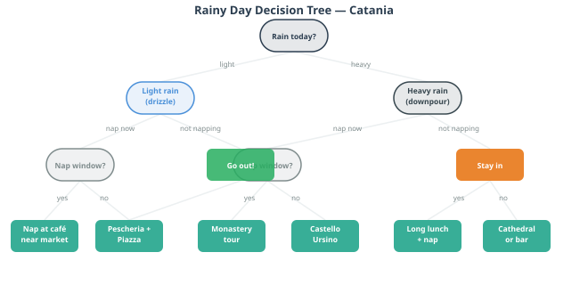
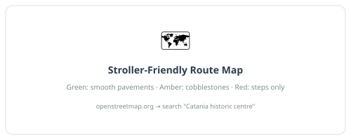

# Chapter 3: Your Base — Practical Catania

---

> *One rule for this trip: park the car, forget the car. Everything you
> need in Catania is on foot. The car is for day trips only. This decision
> alone will eliminate roughly 80% of potential holiday stress.*

---

You are staying in the waterfront district, about 15–20 minutes on foot from
the heart of the historic centre. This is the right call: you are close enough
to walk everywhere that matters, far enough from the tourist scrum around the
Duomo to feel like you are in a real neighbourhood. The fish market is about
15 minutes on foot. Piazza del Duomo is 20 minutes at a comfortable pace with
a pushchair. The best bars and pasticcerie are within that radius. You will not
be relying on the car to do anything in the city itself — and that is a relief,
because central Catania is not designed for people who want to drive through it
in a relaxed manner.

What follows is everything you need to know about operating out of your base
before the day trips begin.

---

## 3.1 Getting Your Bearings

Catania's historic centre is compact in the best way. The main axis is
**Via Etnea**, running north from Piazza del Duomo toward the volcano.
Everything of note is either on this street or within a short walk of it.
**Piazza del Duomo** — the elephant fountain — is your mental anchor point.
When in doubt, navigate back to the elephant and reorient.

Key walking distances from Piazza del Duomo (roughly):

| Destination | On foot from the piazza |
|---|---|
| La Pescheria fish market | 3–5 min |
| Castello Ursino | 15 min |
| Roman theatre | 10 min |
| Benedictine Monastery | 10 min |
| Villa Bellini (public park) | 15 min |
| Best gelato on Via Etnea | 8 min |

From your apartment on Via Cristoforo Colombo, add roughly 15–20 minutes to each of these, heading north.

The city is largely flat in the centre, with some gentle slopes northward
along Via Etnea. The main hazard underfoot is the lava-stone cobbling in the
side streets — uneven, occasionally slippery when wet, and best negotiated
with sensible shoes rather than the sandals you optimistically packed.

---

---

## 3.2 The Car: Park It and Mostly Forget It

You have the car. You will use it for every day trip. In the city, you
will not use it at all if you can help it. Here's how to make that work.

### Parking once and leaving it there

The ideal scenario: you arrive, you drive to your accommodation, you unload,
you park the car in a nearby car park, and you do not see it again until the
first day trip. The area around the historic centre has several options:

- **Parcheggio Borsellino** (Via Dusmet, near the waterfront): large,
  covered, close to the cathedral area. A solid choice for the whole week.
- **Piazza Cavour car park**: slightly north of the centre, easy access,
  reasonable rates.
- **On-street blue lines**: paid street parking, marked with blue lines.
  These work fine for short stays; for leaving the car all week, a proper
  car park gives more peace of mind.

Check with your accommodation — many hotels near the historic centre have
an arrangement with a nearby garage, sometimes at a reduced rate. Ask when
you book, or when you arrive.

### ZTL: The Thing That Will Fine You Without Warning

This is important. Read it.

**ZTL** stands for *Zona a Traffico Limitato* — a Limited Traffic Zone.
Catania's historic centre has a ZTL that covers most of the streets around
Piazza del Duomo and the baroque core. Cameras at the zone boundaries
photograph your number plate automatically. If you drive into a ZTL without
a permit, you will receive a fine in the post — typically €80–150 — weeks
after you've forgotten the moment entirely. It is an extremely efficient system.

The key rules:
- **Do not drive through the centre to reach your hotel.** Ask your
  accommodation for instructions on how to approach from a permitted direction,
  or whether they have a ZTL exemption code for your plate.
- **Loading and unloading is sometimes permitted** at restricted hours (often
  7–10am) — again, ask your accommodation.
- **Google Maps sometimes routes you through ZTL zones.** It does not know
  or care about the fine you will receive. Override it if you see you're
  heading into the old town by car.
- When in doubt, park outside the zone and walk. Always the right answer.

---

---

### Driving the Day Trips

For each day trip, the practical driving notes are in the relevant chapter.
But some general points about driving in Sicily that are worth having once:

**The driving culture** is best described as assertive rather than aggressive.
Sicilian drivers are decisive, quick to fill gaps, and treat lane markings as
helpful suggestions. They are not, in general, angry or confrontational — the
driving style is more like a fast, fluid negotiation than the angry honking
of, say, Rome or Naples. Relax your shoulders, match the pace, and you'll
be fine within a day.

**Roundabouts** work on the principle that whoever is more committed to
entering has priority. This is not what the Highway Code says. It is,
nonetheless, how it works. Enter with confidence or wait for a clear gap.

**Speed cameras** are present on motorways and on some main roads. Indicated
limits are enforced; the cameras are often signed in advance, which does not
always leave enough stopping distance. Drive to the limit consistently rather
than speeding between cameras.

**The motorway (A18/A19):** fast, well-maintained, tolled. Collect a ticket
on entry, pay on exit. Keep a few euros in coins or a card in an accessible
place. The toll amounts for your day trips are all modest (€2–5 each way).

---

## 3.3 Living in the Historic Centre

Staying central means the city's rhythms become your rhythms. Here's what
those look like on a typical day:

**Early morning (7–9am):** the market is in full swing, the bars are doing
their best business of the day. Get to La Pescheria before 10am at least
once. Have your first granita con brioche standing at a bar counter, the way
locals do. This is not breakfast as you know it. It is better.

**Mid-morning (9–11am):** the best time to walk, visit churches, and cover
ground before the heat builds (even in March, midday can get warm). The piazzas
are active but not yet crowded with tour groups.

**Midday (12–3pm):** this is *riposo* time in spirit if not always in practice.
Many smaller shops close. The sensible approach with a toddler is to align
the child's nap with this window — find shade, find a café, stop moving.

**Afternoon (4–7pm):** the city comes back to life. This is the time for
the passeggiata — the early evening stroll that is a genuine social institution,
not a tourist performance. Families, teenagers, elderly couples, all walking
the same streets with no particular destination. Join in. Via Etnea and
Piazza del Duomo are the main stages.

**Evening (8pm onwards):** dinner, in the Sicilian sense, does not start
before 8pm. If you walk into a restaurant at 6:30pm, you will be seated,
but you will be eating alone. The city's evening energy is real and late —
even on weekdays, the streets around the baroque centre stay animated until
midnight. With a toddler, you will probably not be part of this, but you
can sit at an outdoor table and watch it happen over a glass of Etna Bianco.

### Supplies and essentials within walking distance

**Water:** buy a large bottle (or two) from a supermarket and refill from it.
Tap water in Catania is safe to drink. The street-level water fountains
(*nasoni*) around the city also run constantly with fresh water — keep a
small bottle and top up.

**Supermarkets:** there is a Lidl and a Carrefour within 10–15 minutes' walk
of the historic centre. For fresh produce, the **Mercato di Via Plebiscito**
(see Chapter 2) is both better and more interesting. Good for: fruit, blood
oranges by the bag, local cheese, bread, snacks for the day trips.

**Pharmacy:** the green cross symbol. There is at least one within a few
minutes of wherever you are in the historic centre. Hours are typically
9am–1pm and 4pm–8pm; most post a list of the nearest *farmacia di turno*
(the one on overnight/emergency duty) in the window.

**Baby supplies:** nappies, wipes, formula — all available at supermarkets
and some pharmacies. You do not need to pack for a siege. A few days' supply
on arrival, then restock locally.

---

## 3.4 When It Rains

March in Catania brings some rain. Not constant, not all-day deluges as a
rule — more likely short periods of real rain between stretches of bright cool
weather. But it will happen, and it's worth having a plan that isn't "stare
out of the window."

The good news: Catania is a much better rainy-day city than most guides
suggest. Many of its best things are indoors or partially covered.

### Best options when it rains, in rough order of recommendation:

**A very long bar breakfast.** Do not underestimate this. A good Catanian
pasticceria on a rainy morning — *minnuzzi di Sant'Agata*, pistachio
cornetti, sfogliatelle, granita, coffee — is one of the great indoor
experiences of the trip. Take a newspaper or a book. Let the toddler eat
their body weight in pastry. There is no rush.

**The Benedictine Monastery (guided tour).** Entirely indoors, genuinely
spectacular, one of the most interesting spaces in the city. The tour takes
you through the baroque state rooms, the underground Arab-Norman remnants,
and up to the rooftop terrace (skip the terrace in heavy rain; the rest
works fine). Book in advance — tours fill up.

**Castello Ursino and the Civic Museum.** Dark, quiet, sheltered. Better in
the rain than in glaring sunlight, honestly. Good for: the castle architecture,
some interesting Greek pottery, a dry hour when the toddler is in the pushchair.

**Palazzo Biscari.** The finest private baroque palace in Catania, with a
famous oval ballroom with frescoed ceiling. Tours run on specific days —
check the schedule before your trip and try to book a rainy-day slot
in advance. A treat for adults; manageable with a calm toddler.

**The covered section of La Pescheria.** Even in rain, the fish market
operates and part of it is under cover. A rainy morning here is actually
good — the light is different, there are fewer tourists, and the vendors
are in an even better mood because they appreciate you showing up.

**Drive to Ortigia.** Counterintuitive for a rainy day, but Ortigia in the
rain is beautiful — the pale limestone streets, the baroque cathedral, the
covered market, the sense of an island shutting itself in. The drive is an
hour; the reward is real. Pack an umbrella rather than skipping it.

**Drive to the Paolo Orsi Archaeological Museum (Syracuse).** If you're
planning Syracuse as a day trip anyway (see Chapter 7), the Paolo Orsi
museum — one of the finest archaeological museums in Europe — is entirely
indoors and adjacent to the Neapolis park. A rainy Syracuse day can easily
become a museum morning + Ortigia afternoon. Actually a great combination.

---

---

> **On Sicilian rain:** locals treat rain with a mixture of mild irritation
> and philosophical acceptance. An umbrella appears from nowhere. The café
> fills up. Conversation continues. The market keeps going. There is no
> culture of cancelling plans because of weather — the Sicilian approach
> is to absorb it and carry on, which is, when you think about it, the
> right approach.

---

## 3.5 Toddler Logistics

### Medical

**Hospital:** Ospedale Garibaldi Centro on Piazza Santa Maria di Gesù is the
main central hospital, about 15 minutes on foot from the historic centre.
For anything non-emergency, a pharmacy should be the first stop — Sicilian
pharmacists are well-trained and willing to advise.

**European Health Insurance Card (EHIC):** bring it. It covers emergency
treatment in Italian public hospitals without cost. If you don't have one,
sort it before you travel — it takes minutes to apply online and the process
is free.

**Pharmacies near the centre:** there are several on and around Via Etnea.
The *farmacia di turno* rota (emergency cover) is posted in the window of
every pharmacy — useful if you need something at 11pm.

### Stroller Reality

The historic centre of Catania presents a tiered challenge for pushchairs,
which this guide has been honest about throughout. To consolidate:

**Green (smooth sailing):**
- Piazza del Duomo and the immediate surroundings
- Via Etnea itself (the main street is paved, relatively smooth)
- Inside the cathedral and Castello Ursino courtyard
- The waterfront area

**Amber (manageable, with care):**
- The approach streets around La Pescheria (inside the market, step down with
  a ramp available)
- Most of the main pedestrian shopping streets
- Villa Bellini park (gravel paths but mostly level)

**Red (carrier recommended):**
- The lava-stone side streets in the old Arab quarter
- Via dei Crociferi (beautiful but uneven)
- The Roman theatre interior
- Anything described as "a lane" or "a vicolo"

**The honest recommendation:** bring a lightweight carrier as a backup.
Not as a replacement for the pushchair — the pushchair is essential for
nap-time logistics — but as an alternative for the 20-minute stretches where
the pushchair becomes more hindrance than help. The carrier packs small.
Use both, depending on terrain.

---

---

*Next: Chapter 4 — Day by Day — Your Week*

---
