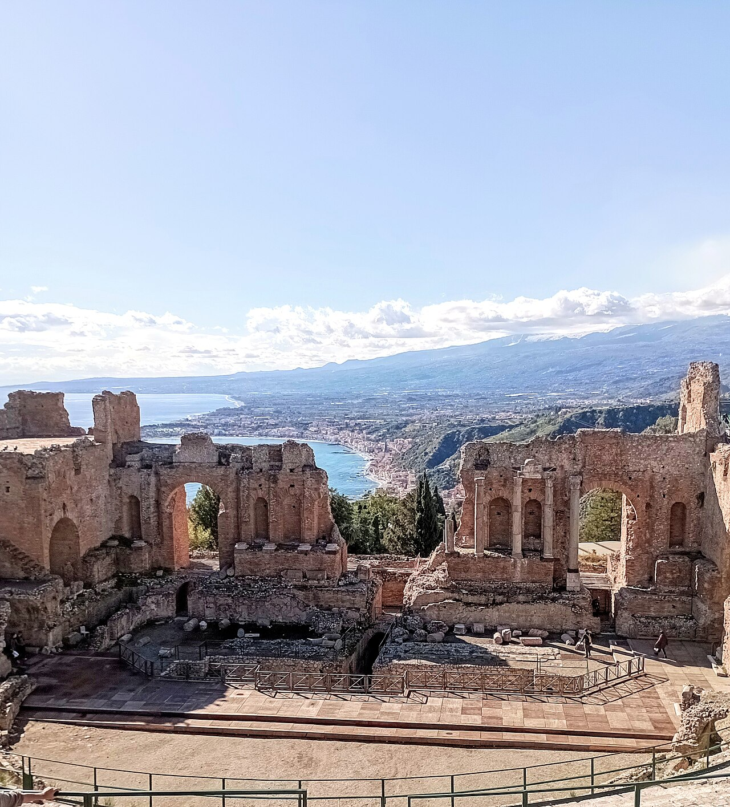

# Chapter 6: Day Trip — Taormina

---

> *"Taormina is the most beautiful place in the world," wrote Maupassant
> in 1885. He was exaggerating slightly. But only slightly.*

---

Let's be honest about Taormina before we go any further: it is both
extraordinary and extremely touristy. These things coexist. The town has
been on every Grand Tour itinerary since the 18th century. It was the
preferred retreat of writers, artists, and aristocrats for two centuries.
D.H. Lawrence lived here. Truman Capote visited. Marlene Dietrich. The
Taormina Film Festival has been running since 1955. The town has been
looking good at its own reflection for a very long time and knows it.

In July and August, this means Taormina is genuinely overwhelmed —
the narrow streets clogged, the restaurants overpriced, the queue for
the Greek theatre stretching back down the hill. In March, it is a
different proposition. The cruise ship tourists are not yet in season.
The town breathes. You can stand in the Greek theatre with the view to
yourself for a moment, and that moment is one of the genuinely remarkable
things you will do this week.

Go. Just go early and come back before the afternoon rush.

---

## 6.1 Why Taormina is Famous

The town sits at 250 metres on a clifftop spur of Monte Tauro, with the
Ionian Sea directly below on one side and the valley — and Etna — on the
other. The position alone would be enough to justify the reputation. But
Taormina has the Greek theatre as well, and the combination of the ancient
theatre with the view is, without much competition, the single most dramatic
scenic moment on the Sicilian east coast.

The **Teatro Greco-Romano** was originally built by Greek colonists in the
3rd century BC — it is one of the largest Greek theatres in Sicily, after
Syracuse. The Romans, characteristically, modified it substantially: they
raised the stage building, changed the orchestra level, and adapted it for
gladiatorial combat and spectacle. What remains is a hybrid that somehow
still reads as classical. And the original Greek architects chose the site
with an eye for staging that has never been surpassed: the backdrop to the
stage is the sea, and behind the sea, on a clear day, Etna.

This was intentional. Greek theatre was a civic and religious act, and the
Greeks who sited this theatre understood that placing drama against the
scale of the sea and a smoking volcano was itself a dramatic statement.
It still works. Two thousand years later, standing in the upper tiers
of the seating on a clear March morning, looking at the stage framing
the sea and the mountain beyond, it still absolutely works.

---

*The definitive shot: from the upper seating tiers looking toward the stage,
with the sea visible through the stage arch and Etna in the background (ideally
with the summit plume). Shoot in the morning — the light comes from the east,
the sea is lit, and Etna is clearest before the afternoon haze builds. This
is the single most iconic photograph of the whole trip.*

---

## 6.2 Getting There

From central Catania, the drive north on the **A18 motorway** takes
about 50 minutes. The motorway follows the coast — the sea to your right
most of the way, the Etna massif building behind you as you leave the
city. The drive itself is pleasant, with two or three tunnel sections cut
through the coastal headlands. There is a toll; keep coins or a card
accessible.

**The parking question** is the key logistical issue for Taormina.
The town is not accessible by car — or rather, you cannot drive into
the town itself without local permits, and even the approach roads are
narrow, one-way in sections, and stressful if you don't know them.
The solution is straightforward:

**Park at Mazzarò**, at the base of the cliff, immediately below Taormina.
The car parks here are large, well-signed from the motorway exit, and
directly adjacent to the lower cable car station. This is where you park.
Always.

From Mazzarò, the **cable car (funivia)** takes you up to the edge of
town in a few minutes — small, frequent, cheap, and the views going up
give you your first proper sense of Taormina's position. The cable car
runs regularly and the queues in March should be short.

**One alternative parking option** if Mazzarò is full or closed for any
reason: **Lumbi car park**, higher on the approach road and accessed from
the north side — this puts you closer to town but involves more walking on
uneven roads. Mazzarò is the better choice for a family with a pushchair.

**From the cable car station at the top**, you enter the town via a short
walk up through the gardens. The main street — **Corso Umberto** — begins
here and runs the length of the town from one end to the other.

---

## 6.3 The Must-Sees

### The Greek Theatre

Go here first. Immediately. Before the café, before the Corso, before
anything else. The theatre opens at 9am (or earlier in some seasons —
check in advance) and the early morning, before the tour buses arrive,
is the only time you will have it to yourself.

**What to do inside:** buy your tickets at the entrance, walk through
into the theatre, and then do not stop at the lowest level. Walk up the
seating tiers — there are steps to either side — until you reach the
upper rows. Sit down. Look at the view for at least five minutes before
you look at the theatre itself.

The view from the upper tiers is the reason the theatre was built where
it was built. The stage arch frames the sea; the sea is framed by the sky;
and Etna, on a clear March morning, fills the northern horizon behind and
above the whole composition. The scale is such that the ancient architecture
and the geology seem to be participating in the same design.

Then look at the theatre itself. The Roman stage building — partially
restored, still massive — gives a sense of the spectacle that was staged
here. The semicircular seating, cut into the hillside in the Greek manner.
The orchestra level. The whole geometry of the space, which directs your
eye back to the view at every turn.

**Stroller note:** the entrance is manageable at ground level. To reach
the upper tiers, there are steps. Carry the toddler up; leave the pushchair
at the lower level or fold it at the entrance. The extra effort is worth
it — the view from the upper tiers is the whole point.

**Time to allow:** 45 minutes to an hour, if you're being honest. You
will stay longer than you plan to.

---

### Villa Comunale (Public Gardens)

At the eastern end of the Corso Umberto, beyond the theatre, the public
gardens designed by Lady Florence Trevelyan in the late 19th century
offer an entirely different kind of Taormina experience. Lady Trevelyan
was English, eccentric, and passionate about botany — she filled the
gardens with exotic plants collected from her travels, built several small
fantasy pavilions (one of which looks like a birdcage crossed with a Swiss
chalet), and created a space that somehow manages to be both genuinely
beautiful and mildly ridiculous at the same time.

The gardens have sea views from the eastern edge — on a clear day you can
see south toward Catania and north toward the Strait of Messina. There are
paths wide enough for a pushchair, benches in the shade, and enough open
space for a toddler to run without disappearing over a cliff.

**Good for:** the nap window, if the timing works. A bench in the shade
of the gardens with the sea below is a very good place to sit while the
child sleeps in the pram.

---

### Piazza IX Aprile

Midway along the Corso Umberto, Piazza IX Aprile opens to the south as
a broad terrace over the valley. This is the view that appears on every
Taormina postcard — the coastline stretching south, Etna behind it, the
sea below, the town framing it all. There is a café on the square; you
should have at least one drink here, on the terrace, looking at this view.

The piazza also has the clock tower (Torre dell'Orologio), which marks
the original entrance to the medieval town, and the church of Sant'Agostino
(now a library). None of this competes with the view, and none of it
needs to.

---

### The Corso Umberto

The main street runs the full length of the town, mostly pedestrianised,
and is the central artery of Taormina life. In tourist season it is a
gauntlet of souvenir shops, ceramics stalls, linen displays, and restaurant
touts. In March it is considerably calmer.

There are genuinely good things among the shops: **Caltagirone ceramics**
(the traditional yellow and blue Sicilian style — excellent and packable),
quality linen and embroidery, local food products (pistachio cream, Marsala
wine, dried herbs). The art is to identify the shops that are selling
something real rather than something made in a Chinese factory with a
Sicilian flag on the box. Price is usually the guide: if the pistachio
cream is suspiciously cheap, it probably contains approximately 8%
pistachio.

**The best gelato** in Taormina is not in the obvious places on the Corso.
Ask at a bar for where the locals go. Alternatively: **granita con brioche**
at any bar that has queuing Italians rather than tourists — the granita
in Taormina is good, the mulberry flavour in season is exceptional.

**Stroller note:** the Corso itself is paved and manageable. The side
streets stepping down from the Corso are often steep stone steps — the
town is on a cliff and the terrain is unforgiving of anything with wheels.
Keep to the Corso and the theatre for pushchair use; carrier for exploration
beyond.

---

## 6.4 Eating in Taormina

The honest answer: eating in Taormina costs more than eating in Catania,
and the quality does not always justify the premium. The best strategy:

**Avoid the restaurants that face directly onto the main piazzas.** They
are good at marketing themselves and feeding large numbers of tourists
efficiently. They are not always good at feeding you well. The restaurants
in the streets just behind the Corso — one alley back, slightly harder to
find — are where the better food happens.

**Lunch rather than dinner.** You are driving back to Catania in the
afternoon. A good lunch at a table with a view is the right Taormina meal.
Dinner in a tourist town at tourist prices is the wrong one.

**What to order:** fresh grilled fish is the right call. The swordfish
(*pesce spada*) on this part of the coast is excellent. Pasta with clams
or mussels. Arancino as a starter if you haven't had one yet today.

**If budget is a concern:** the town has a small alimentari and a
supermarket that are much harder to find than the restaurants. A picnic
in the Villa Comunale — bread, local cheese, tomatoes, blood oranges,
something sweet — is a legitimate and enjoyable Taormina lunch and costs
a fraction of a sit-down meal.

---

## 6.5 Honest Notes

**The crowds** in March are manageable. In May, already beginning to
build. July and August: genuinely overcrowded in a way that diminishes
the experience significantly. You are going at the right time of year.

**The cable car** can have queues in peak season. In March, walk-up is
usually fine. Check the Funivia Taormina website for the current season
schedule before you go, as hours vary.

**The weather** matters more in Taormina than in the valley. Being on
a clifftop at 250m means the wind can be significant even on a warm day —
bring a light layer. The view is also much more variable in cloud or mist;
a misty day in Taormina is still beautiful but the famous view collapses
into grey. In light rain, the town is lovely and far quieter; heavy rain
is worth postponing for.

**Coming back:** leave Taormina by 3:30–4pm to avoid the early evening
traffic on the A18 southbound toward Catania. The motorway can be slow
around Giarre-Riposto junction; if traffic is visible, the state road
along the coast (SS114) is a scenic alternative and runs parallel all
the way back.

---

> **A historical footnote worth knowing:** Taormina in the late 19th
> and early 20th centuries was one of the first places in Europe where
> gay men could live relatively openly — the combination of Italian
> tolerance, distance from northern European social norms, and the
> bohemian artistic community created an unusual pocket of freedom.
> The German photographer Wilhelm von Gloeden documented Sicilian youth
> here in the 1890s in photographs that are still exhibited in the town.
> The writer and traveller Norman Douglas wrote about Taormina with
> knowing enthusiasm. The town has always attracted people seeking
> a life lived differently. It is part of the cultural texture of the
> place, and worth knowing.

---

*Next: Chapter 7 — Day Trip: Syracuse & Ortigia*

---
