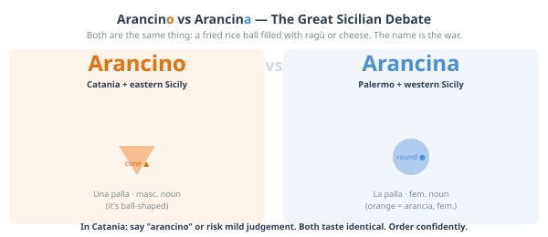

# Chapter 9: Eat Your Way Through Catania

---

> *"In Sicily, eating is not a biological necessity. It is a cultural
> position. A declaration of values. A form of argument."*

---

There is a reason this chapter comes after all the day trips and before
the practical tips. Food is not a footnote to your time in Catania — it is
woven through everything you do, every morning, every afternoon, every evening.
The granita you had on the first day. The fish you watched being sold at La
Pescheria at 8am and then ate for lunch an hour later. The arancino you ate
standing up in the street because there was nowhere to sit and no time to wait.

All of that is this chapter. So is the history behind it — because to eat
well in Sicily, it helps to understand why Sicilian food tastes the way it
does, and the answer to that question is twelve centuries of Arab, Norman,
Greek, Spanish, and Italian history all ending up in a single dish.

---

## 9.1 The Arab Kitchen — Sicily's Secret Ingredient

Here is the thing most people don't know about Sicilian food: it is profoundly,
structurally Arab.

Between the 9th and 11th centuries, Arab and Berber forces from North Africa
controlled most of Sicily and transformed its agriculture, its irrigation, and
its diet more thoroughly than any conqueror before or after. They introduced
sugar cane — and with it the concept of confectionery that defines Sicilian
pastry culture today. They introduced rice — and with it, eventually, arancino.
They introduced aubergine, which became the central ingredient of two of Sicily's
defining dishes (*caponata* and *pasta alla Norma*). They introduced almonds,
pine nuts, raisins, saffron, cinnamon, and cumin — the spice vocabulary that
makes Sicilian cooking unlike any other regional Italian cuisine and immediately
recognisable once you know what you're tasting.

The Arab sweet-sour flavour combination — *agrodolce* — runs through Sicilian
cooking as a structural principle. Sweet elements (raisins, honey, sugar) and
sour elements (vinegar, citrus) appear together in both savoury and sweet dishes
in combinations that would be unusual in northern Italian cooking and that trace
directly back to the medieval Arab kitchen. Caponata: sweet-sour. Sarde a
beccafico: sweet-sour. The flavour of a good Sicilian aubergine dish: sweet-sour.

This is not ancient history. It is what your food tastes like. Every time you
eat something in Catania this week, you are eating a culinary tradition that
absorbed Arab, Greek, Norman, and Spanish influences over a thousand years and
emerged as something entirely its own.

---

## 9.2 The Essential Catanian Foods

What follows is not a comprehensive list of Sicilian food — that would be
a book in itself, and a long one. This is the list of things you should
specifically eat in Catania, ideally in the way described, ideally in the
order that your schedule and appetite allow.

---

### Granita con Brioche — The Sicilian Morning

You have already had this. You will have it again. You should have it every
morning if that is what you want, because it is exactly that kind of thing.

A Sicilian granita is not a smoothie, not a slushie, not a snow cone. It is
a semi-frozen preparation made from water, sugar, and a real flavouring
ingredient — almonds, pistachios, coffee, citrus, fresh berries, mulberry,
jasmine — that is agitated as it freezes to produce a fine, icy, intensely
flavoured texture that is somewhere between sorbet and crushed ice and neither.
It is served in a glass, often with a small portion of *panna* (whipped cream)
on top, alongside a **brioche** — a soft, slightly sweet bread roll made with
lard that is the Sicilian version, distinct from the French brioche.

You eat the brioche with the granita. You break off a piece and use it to
scoop. Or — the Catanian version — you split the brioche open and fill it
with the granita directly, eating it like an ice cream sandwich. This is
breakfast. Not a dessert, not a treat — breakfast. The bar culture around
this is completely normalised; ordering a granita at 7:30am alongside your
espresso raises no eyebrows.

**The best flavours:** almond (*mandorla*) is the most traditional and the
most Sicilian — made from ground almonds and almond milk, intensely flavoured,
completely different from anything you'll have had before. Pistachio
(*pistacchio*) is rich and extraordinary, especially if made with Bronte
pistachios. Coffee (*caffè*) is the purist's choice. Lemon (*limone*) is
sharp and clean. Mulberry (*gelsi*) in season (late spring/summer) is exceptional.

**Where to get it:** any good bar or pasticceria in Catania. The rule of thumb:
if the granita is made on site (not from a commercial preparation), it will
be better. Ask if it is *artigianale* (artisan-made). The price is low
everywhere — this is not a premium product.

---

### Arancino — Catania's Own

The arancino (Catanian) or arancina (Palermitan) debate is the most actively
contested food argument in Sicily, and it is about both the name and the shape.

In Catania, it is **arancino** (masculine), it is **conical** — shaped like
a small version of Etna, a point that Catanesi make with complete seriousness —
and the standard filling is a ragù of meat, tomato, and peas. In Palermo,
it is **arancina** (feminine), it is round, and the culture around it is
different in ways that Palermitans will explain at length if given the
opportunity.

In both cases: a ball of cooked and seasoned risotto rice, shaped around a
filling, breaded, and deep fried until the exterior is golden and crunchy
and the interior is hot and soft and yielding. When done well — and in
Catania, it is done well frequently — it is one of the great street food
experiences anywhere.

**The fillings:** the classic ragù (meat, tomato, peas) is the baseline.
Butter and mozzarella (*al burro*) is the alternative — simpler, excellent.
Modern variants include spinach and ricotta, pistachio and sausage, and
whatever the creative arancino-maker of the day has decided to try. The
classic ragù is the right first order.

**When to eat it:** technically any time of day, but arancino is quintessentially
a morning or midday food in Catania — eaten standing up at a bar, wrapped in
paper, before or during the morning market. It is not a dinner. It is not a
sit-down restaurant item. It is street food, and it should be eaten as such.

**Where to get it:** the bars around La Pescheria are the traditional morning
arancino territory. Find the place with a queue of people in work clothes.

---

*A fun illustrated spread: on the left, the Catanian arancino — conical shape,
labelled with the Etna comparison, masculine article, "al ragù" filling. On the
right, the Palermitan arancina — round shape, feminine article, different filling
tradition. A map of Sicily showing the approximate boundary between the two
naming traditions. Tone: playful, partisan (this guide is from Catania), clearly
not taking itself too seriously.*

---

### Pasta alla Norma — The City's Own Pasta

This is Catania's contribution to the canon of Italian pasta dishes, and it
was invented here, and it is named after an opera, and this is entirely normal
for a city that produced Vincenzo Bellini.

**Bellini** — whose opera *Norma* premiered in Milan in 1831 and immediately
entered the repertoire of great works — was born in Catania in 1801. His
birthplace, on Piazza San Francesco, is now a museum. His monument stands in
the public gardens. The Teatro Massimo Bellini — the city's main opera house,
inaugurated in 1890 — is named after him. And, most deliciously, when a local
chef created a pasta dish so good that a fellow Catanian exclaimed *"è una
Norma!"* — meaning it was as magnificent as Bellini's opera — the dish kept
the name.

**The dish:** rigatoni (or sometimes spaghetti) with a fresh tomato sauce,
deep-fried slices of aubergine, a grating of ricotta salata (a firm, salty,
dry ricotta quite different from the fresh version), and fresh basil. It is
simple, summer-focused, and completely dependent on the quality of its
ingredients — which in Catania in the tomato and aubergine season is
exceptional. In March, it is slightly off-peak seasonally, but still very good.

If someone tells you something is *una Norma* in Catania, they mean it's the
best thing they've had in a while. Cook this dish when you get home and tell
people the story. They will be impressed.

---

### Sarde a Beccafico — The Arab-Norman Palimpsest on a Plate

This dish is a direct taste of the Arab-Norman fusion that defines so much
of Sicilian cooking. Fresh sardines, butterflied and filled with a mixture
of breadcrumbs, pine nuts, raisins, and sometimes orange zest, then rolled,
packed tightly in a baking dish, and baked. The sweet (raisins, orange) and
savoury (sardines, breadcrumbs) combination is precisely the *agrodolce*
principle at work — and the ingredients trace directly to the Arab pantry of
9th-century Sicily.

The name refers to the **beccafico** — a small migratory bird that in autumn
grows fat on figs and was considered a delicacy by the Sicilian aristocracy.
The rolled sardines, tails pointing upward, are said to resemble the little
birds. This is the kind of culinary metaphor that tells you something about
the culture that created it: a dish invented to let ordinary people eat
something that looks like an aristocratic delicacy, named with a knowing wink.

It is not universally available in Catania's restaurants — more common in
Palermo, where it is a staple — but when you see it, order it.

---

### Caponata — Sicily in a Bowl

A sweet-sour aubergine stew that appears everywhere in Sicily as an antipasto,
a side dish, or a meal in itself. The core ingredients are aubergine (fried
separately and then combined), tomato, celery, olives, capers, vinegar, and
sugar. The balance between the sweet and the sour is the cook's art, and it
varies significantly from kitchen to kitchen.

Caponata is served at room temperature, which is correct and intentional —
it is not a hot dish. It improves with sitting. The best version you eat this
week will probably be one you have for lunch as an antipasto when the kitchen
made it that morning or the night before.

**Take some home if you can:** good-quality jarred caponata is sold in the
markets and in good food shops throughout Catania, and it is one of the more
transportable and authentic things to bring back.

---

### Street Food at La Pescheria

The market experience includes eating. This is not optional.

Along the edges of La Pescheria, especially at the street-facing end near the
arch on Via Garibaldi, vendors sell prepared seafood for immediate consumption.
The main things to try:

**Polipo bollito** — boiled octopus, served whole (for a small octopus) or
in chunks, with lemon and salt. Eaten standing up with a toothpick from a
paper cup. Extraordinarily fresh. A specific kind of delicious that only works
when the octopus was in the water the previous day.

**Ricci di mare** — sea urchin, split open in front of you, the orange interior
scraped out and spread onto a piece of bread. Sea urchin has a flavour that
is described inadequately as "intensely oceanic" — it is the concentrated
essence of the sea. You either become immediately addicted or you do not.
There is almost no middle ground.

**Cazzilli** — small fried potato croquettes, simple, addictive, sold from
carts near the market and throughout the street food scene of Catania.

**Fried things in paper cones** — various small seafood items, battered and
fried, sold by weight. Order a mixed portion and eat it walking.

None of this costs much. All of it is better eaten at 8am, leaning against
the market wall, with a coffee from the nearest bar as counterpoint.

---

### Cannoli — The One You Came For

Let us address the cannolo directly, because there are cannoli and there are
cannoli, and the difference matters.

The shell should be thin and crisp, made from fried pastry dough, and it should
shatter when you bite into it. If it does not shatter, the shell has been
sitting too long and the filling has softened it. This is not a good cannolo.

The filling is fresh sheep's milk ricotta, sweetened, sometimes flavoured
with vanilla or a little cinnamon, studded with chocolate chips or candied
orange peel or pistachio. The ricotta should taste of sheep's milk — fresh,
slightly grassy, creamy. If it tastes of nothing in particular, it is not
fresh sheep's milk ricotta.

**The crucial rule:** the cannolo should be filled in front of you, to order.
A cannolo that was filled in advance, sitting in a display case for hours,
is a version of a cannolo that you should decline politely and move on. The
shell will have absorbed moisture from the ricotta and lost its structural
integrity. The flavour combination that makes a cannolo extraordinary requires
the contrast between the crisp shell and the soft filling to be intact. This
only happens if you eat it within minutes of filling.

The best cannoli in Catania are served at the pasticcerie that make the shells
and the ricotta themselves. Ask locals; the recommendations will be specific
and vehement.

**For the toddler:** yes. Obviously yes.

---

### Minnuzzi di Sant'Agata — The Pastry With a Story

Available in every pasticceria in Catania, particularly in and around the
festival period in February: small white confections made from marzipan or
a ricotta-based filling, shaped and iced to represent the breasts of Sant'Agata.
The saint was martyred by having her breasts cut off, and Catanesi have been
making pastries in her honour in this specific shape since at least the medieval
period.

This is — to understate considerably — an unusual confection. It is also
very good. The marzipan version is almond-flavoured and dense; the ricotta
version is lighter and slightly sweeter. They are sold year-round and are
one of the more distinctively Catanian things you can buy or eat here.
The story behind them is worth knowing, and worth telling to anyone who asks
why your souvenir box of pastries looks the way it does.

---

### The Blood Orange — Not a Metaphor, Actually a Blood Orange

The **Arancia Rossa di Sicilia** — the blood orange of Sicily — is a DOP
(Protected Designation of Origin) product grown in the volcanic soil of the
Etna foothills and the Catania plain. Three varieties: Moro (deepest red, most
pigmented, slightly berry-forward), Tarocco (the sweetest, most complex, the
one most Sicilians consider the finest), and Sanguinello (darker and more
tannic). The red pigmentation comes from anthocyanins that develop in response
to cold night temperatures — the same volcanic soil and diurnal temperature
variation that makes Etna wine distinctive is what makes the blood orange extraordinary.

These are not the blood oranges you buy in the supermarket at home. The ones
grown here taste different: more complex, with a berry note layered over the
citrus that makes them unlike any other orange. The season is roughly November
to May — you are going at the right time.

**Buy them at the market** by the kilo. They are extraordinarily cheap. Eat
them as fruit; drink the juice squeezed fresh (*spremuta*) at any bar; take
a bag home if your luggage allows it.

---

## 9.3 Where and How to Eat

### The Structure of a Sicilian Meal

A proper Sicilian restaurant meal works in this sequence:

**Antipasto** — the starter. Often the best course. In Catania: caponata,
bruschetta, seafood selections, arancino, local cheeses, cured meats.
Order more than you think you need.

**Primo** — the pasta or risotto course. This is not a starter in the
Anglo-Saxon sense — it is a full course. Pasta alla Norma, pasta with
clams (*alle vongole*), pasta with sea urchin (*ai ricci*) if you're feeling
ambitious, pasta al nero di seppia (with cuttlefish ink, dramatic-looking,
excellent-tasting).

**Secondo** — the main course. Fish is the right call in Catania: grilled
swordfish (*pesce spada alla griglia*), grilled tuna (*tonno*), baked sea
bream (*orata*). Meat is also available; the Sicilian mixed grill is good.
Vegetables served separately as *contorni* — order the grilled aubergine
and the fried courgettes.

**Dolce** — dessert. Cannolo, obviously. Cassata siciliana (if you're in
the mood for something baroque in structure as well as origin — a ricotta
and marzipan cake with candied fruit). Gelato. Or, if you have been eating
for two hours, a small almond pastry and another coffee.

**You do not have to eat all of this at every meal.** In practice, a lunch
might be antipasto + primo, or just a good secondo with bread. The full
four-course structure is for evenings and celebrations. But knowing it
means you will not be confused when the menu lists five different sections
and the waiter expects you to navigate them.

---

### Timings — The Most Important Practical Note

Sicilian meal times are not Italian meal times, which are already late by
northern European standards. They are later.

**Breakfast:** 7–10am, at a bar, standing or at a small table.

**Lunch:** 1pm–3pm. Restaurants will not seat you for lunch at noon; they
will be setting up. The earliest realistic sit-down lunch is 12:45pm.

**Dinner:** no earlier than 8pm. Many restaurants don't fill until 9pm.
The full Sicilian dinner culture moves late in a way that is difficult to
reconcile with a toddler who needs to be in bed by 8:30pm.

**The family solution:** eat your main meal at lunch, when the food is the
same quality, the pace is slightly faster, and the prices are occasionally
lower. Use dinner as a lighter, earlier affair — a tavola calda (hot food
counter), a pizza, something simple at 7:30pm before the local restaurants
have warmed up. Nobody will think less of you for this.

---

### Types of Places to Eat — The Hierarchy

**Ristorante:** full service, full menu, full prices. The place for a special
occasion meal.

**Trattoria:** simpler, often family-run, shorter menu focused on local cooking.
The correct choice for a good lunch at honest prices. Usually no printed menu
or a very short one — the waiter will tell you what's available.

**Osteria:** even simpler, often wine-focused, sometimes no kitchen or very
limited food. For drinking, primarily.

**Tavola calda:** literally "hot table" — a canteen-style place with prepared
food on display and counter service. Extremely good value, completely unpretentious,
often excellent. The closest Sicilian equivalent to a good deli lunch. Very
toddler-friendly.

**Bar/Pasticceria:** for breakfast, granita, coffee, pastries, a quick arancino.
Not for lunch or dinner, but the most important category for the first two hours
of every day.

**Street food vendors:** at markets, in the streets near the fish market, at
certain fixed positions around the city centre. The cheapest eating in Catania
and, often, the most memorable.

---

`[INFOGRAPHIC: The Catania Food Map]`
*A visual guide to the key dishes, laid out as a day: what you eat for
breakfast (granita, brioche, espresso, arancino), what you eat at the market
(octopus, ricci, fried things), what you eat at lunch (pasta alla Norma,
caponata, sarde a beccafico), what you eat for dessert (cannolo, cassata,
gelato, minnuzzi di Sant'Agata). Central illustration could be an arancino
with everything radiating from it. Warm colours, illustrated style.*

---

## 9.4 Drinking in Catania

### Coffee

Sicily takes coffee seriously in the Neapolitan tradition — espresso, short,
strong, consumed quickly at the bar counter. The Sicilian variation: coffee
granita for breakfast, as described above, or *caffè d'orzo* (barley coffee)
as an alternative if you want something lighter. Ordering a "latte" in a Sicilian
bar will get you a glass of warm milk. Order *cappuccino* until 11am; after
that, only tourists order milky coffee, and you will be identified as one.

### Wine

Sicily is a serious wine region with a rapidly evolving reputation, and the
wines available in Catania for local prices represent extraordinary value.
The main categories to know:

**Etna Rosso** — made from Nerello Mascalese grapes grown at altitude on
the volcanic slopes of Etna. Elegant, perfumed, with a lightness of body
that can surprise people expecting a big Sicilian red. The comparison often
made by wine critics is to Burgundy — not in flavour, but in the relationship
between the wine, the specific volcanic soil (*terroir*), and the altitude.
Several small producers are now internationally famous and exported at prices
that would make your eyes water in London or New York. In Catania you can
drink them for €15–25 a bottle. Do.

**Etna Bianco** — made from Carricante and other local white varieties.
Mineral, saline, with a freshness and complexity that makes it one of the
most interesting Italian whites of the moment. The right wine with the
grilled fish at Aci Trezza. The right wine with the seafood pasta in Ortigia.
The right wine in general, throughout the week.

**Nero d'Avola** — the great red grape of southern Sicily, grown widely
across the island. Rich, dark, full-bodied, with a flavour of black cherries
and dark spice. Not an Etna wine, but a Sicilian classic. Good with the
meat-based pasta dishes and the secondo of grilled meat.

**Malvasia delle Lipari** — technically from the Aeolian Islands, but
available throughout Sicily. A sweet, amber-coloured dessert wine with
extraordinary concentration and a honeyed, apricot character. Order it with
a cannolo or at the end of the meal instead of dessert.

### Blood Orange Juice

Already covered in the food section, but worth repeating in the drinks
context: *spremuta di arancia rossa* — freshly squeezed blood orange juice —
is available at every bar that has a juicer and is the single best non-alcoholic
drink of the trip. Order it for the toddler every morning. Order it for yourself
every morning. It is a different product from orange juice as you know it.

---

*Next: Chapter 10 — Family Field Guide*

---
